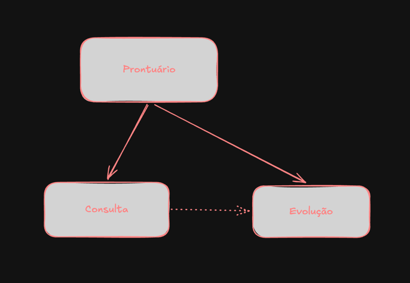

Precisamos implementar uma nova entidade no sistema.
A nova entidade é a de _evolutions_ (evoluções)

O conceito de evoluções no dia a dia do dermatologista é o seguinte:
* Consulta: é o atendimento médico propriamente dito. Inclui a entrevista com o paciente (anamnese), exame físico, avaliação, diagnóstico, solicitação de exames, prescrição e orientações.
* Evolução: é o registro clínico feito no prontuário descrevendo o estado do paciente e as observações do profissional em um determinado momento. Pode ocorrer durante uma consulta, durante uma internação, em visitas diárias ao leito, em retornos ambulatoriais, entre outros contextos.

Então o que podemos tirar disso é o seguinte.
Uma evolução pode ser oriunda de varias fontes:
* Durante uma consulta ambulatorial.
* Durante uma visita diária a um paciente internado.
* Após a análise de resultados de exames.
* Após um contato telefônico ou por telemedicina (dependendo das normas aplicáveis e da instituição).
* Após um procedimento.
* Em resposta a uma intercorrência hospitalar.
* Em discussões multiprofissionais sobre o caso.

Anexei uma imagem para demonstrar a ideia da relação entre consulta <> prontuário <> evolução

Me ajude a discorrer sobre a ideia e sobre a implementação no sistema.