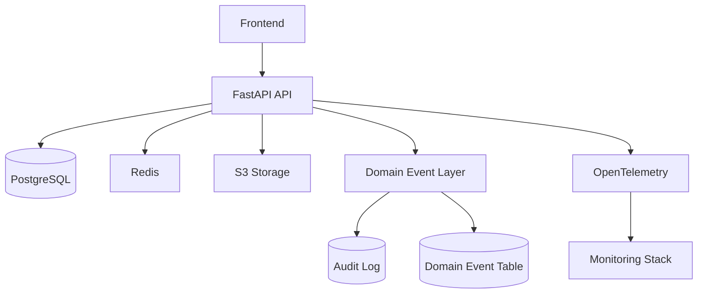

# PRONTUÁRIO DERMATOLÓGICO
## Documento Técnico Oficial – Versão 1.0

---

# 1. Objetivo do Sistema

Desenvolver um sistema de prontuário eletrônico dermatológico com:

- Gestão de pacientes
- Registro de consultas
- Catálogo de doenças
- Catálogo de medicamentos
- Upload de imagens clínicas (S3)
- Comparação de imagens lado a lado
- Mapeamento corporal de lesões (modelo FotoFinder-like)
- Auditoria completa
- Arquitetura preparada para SaaS

---

# 2. Princípios de Engenharia

## 2.1 SOLID (Obrigatório)

- **S** – Single Responsibility
- **O** – Open/Closed
- **L** – Liskov Substitution
- **I** – Interface Segregation
- **D** – Dependency Inversion

## 2.2 Regras Arquiteturais

1. Separação clara de camadas:
   - Controllers
   - Services
   - Repositories
   - Domain
2. Nenhuma regra de negócio na camada HTTP.
3. Repositories não devem conter regra de domínio.
4. Toda dependência deve ser injetada.
5. Código deve ser testável sem banco real.
6. Todas as entidades clínicas devem possuir `doctor_id`.
7. Nenhuma query pode ignorar `doctor_id`.

---

# 3. Stack Oficial

| Camada | Tecnologia |
|--------|------------|
| Linguagem | Python 3.12+ |
| Framework | FastAPI |
| ORM | SQLAlchemy 2.0 (async) |
| Banco | PostgreSQL 15+ |
| Cache | Redis |
| Storage | AWS S3 |
| Testes | pytest |
| Logs | structlog |
| Telemetria | OpenTelemetry |
| Container | Docker |
| CI/CD | GitHub Actions |

---

# 4. Arquitetura Geral

--- 

erDiagram

    DOCTOR {
        uuid id PK
        string name
        string email
        string password_hash
        timestamp created_at
    }

    PATIENT {
        uuid id PK
        uuid doctor_id FK
        string name
        date birth_date
        string gender
        string phone
        text notes
        timestamp created_at
    }

    CONSULTATION {
        uuid id PK
        uuid doctor_id FK
        uuid patient_id FK
        date consultation_date
        text chief_complaint
        text physical_exam
        text conduct
        timestamp created_at
    }

    DISEASE {
        uuid id PK
        string name
        string cid10
        text description
    }

    MEDICATION {
        uuid id PK
        string name
        string active_principle
        string form
        text notes
    }

    IMAGE {
        uuid id PK
        uuid doctor_id FK
        uuid patient_id FK
        uuid consultation_id FK
        string s3_key
        string type
        string body_region
        float coord_x
        float coord_y
        timestamp created_at
    }

    LESION {
        uuid id PK
        uuid doctor_id FK
        uuid patient_id FK
        string label
        string body_region
        float coord_x
        float coord_y
        string status
        text notes
        timestamp created_at
    }

    AUDIT_LOG {
        uuid id PK
        uuid doctor_id
        string entity_type
        uuid entity_id
        string action
        json before_state
        json after_state
        string ip_address
        string user_agent
        timestamp created_at
    }

    DOMAIN_EVENT {
        uuid id PK
        string event_type
        uuid entity_id
        json payload
        timestamp created_at
        boolean processed
    }

# 6. Endpoints Principais

## 6.1 Pacientes
	•	GET /patients
	•	POST /patients
	•	GET /patients/{id}
	•	PUT /patients/{id}
	•	DELETE /patients/{id}

## 6.2 Consultas
	•	GET /patients/{id}/consultations
	•	POST /patients/{id}/consultations

## 6.3 Doenças
	•	GET /diseases
	•	POST /diseases

## 6.4 Medicamentos
	•	GET /medications
	•	POST /medications

## 6.5 Imagens
	•	POST /images/presigned-url
	•	GET /patients/{id}/images

## 6.6 Lesões
	•	POST /patients/{id}/lesions
	•	GET /patients/{id}/lesions
	•	PUT /lesions/{id}

# 7. Camada de Eventos

## 7.1 Domain Events

### Toda operação de escrita deve gerar um evento:
	•	PatientCreated
	•	PatientUpdated
	•	ConsultationCreated
	•	ImageUploaded
	•	LesionUpdated

## 7.2 Fluxo
	1.	Service executa ação
	2.	Repository persiste
	3.	EventBus publica evento
	4.	Auditoria registra log

# 8. Auditoria (Obrigatório)

## 8.1 Toda operação de escrita deve registrar:
	•	doctor_id
	•	entity_type
	•	entity_id
	•	action
	•	before_state
	•	after_state
	•	timestamp
	•	ip_address
	•	user_agent

## 8.2 Regras
	•	Logs nunca podem ser editados
	•	Logs nunca podem ser deletados
	•	API não deve expor endpoint para alteração de logs

# 9. Segurança
	•	HTTPS obrigatório
	•	JWT com refresh rotativo
	•	doctor_id vindo do contexto autenticado
	•	Índice obrigatório em doctor_id
	•	S3 bucket privado
	•	Versionamento habilitado

# 10. Performance
	•	Paginação obrigatória
	•	Índices compostos (doctor_id + created_at)
	•	Evitar N+1 queries
	•	Upload via URL pré-assinada
	•	Compressão GZIP ativada
	•	Lazy loading controlado

# 11. Testes

## 11.1 Unitários
	•	Services
	•	EventBus
	•	Regras de autorização

## 11.2 Integração
	•	Repositories
	•	Persistência de eventos
	•	Persistência de auditoria

## 11.3 Cobertura
	•	Mínimo 80%

## 12. Criptografia
	
### Infra
- Postgres com volume/serviço encrypted at rest
- Backups encrypted (nativo)
- S3 com SSE-KMS + bucket privado
- TLS no Load Balancer/Ingress 

### Código
- Hash de senha (bcrypt/argon2)
- Isolamento por doctor_id
- URLs pré-assinadas para upload
- Auditoria imutável

## 12.Diretriz Final

Este sistema deve ser desenvolvido como produto escalável desde o início.

Reescritas estruturais devem ser evitadas.
Arquitetura deve priorizar clareza, segurança e extensibilidade.